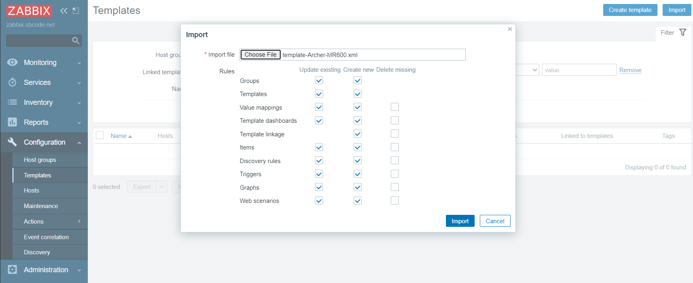
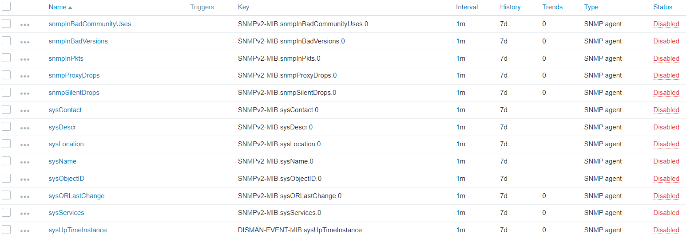

# SNMPWALK2ZABBIX

Create a Zabbix template from an SNMPWALK response.

Note that this will not create a fully featured all bells and whistles perfect template exactly for your needs. You will need to edit the result to make it exactly whatever you want it to be.

Remember, you got it for free, and it comes with no support or warranty. Read the [license](LICENSE).

## Download

```bash
wget https://raw.githubusercontent.com/Sean-Bradley/SNMPWALK2ZABBIX/master/snmpwalk2zabbix.py
```

## Requirements

- Linux (Tested on Ubuntu 20.04),
- Python3
- SNMP (uses SNMPv2 to query)
- SNMP-MIBS-Downloader
- Any other custom or proprietry MIBs you may want to use.

To install SNMP and snmp-mibs-downloader on Ubuntu 20.04,

```bash
sudo apt update
sudo apt install the snmp tools and snmp-mibs-downloader
```

## Usage

```bash
python3 snmpwalk2zabbix.py community-string IP-address root-OID
```

- `community-string` : This is the v2c community name. Most systems default to use `public` as the community name.
- `IP-address` : The IP addess of the SNMP device that returns a valid `snmpwalk` response.
- `root-OID` : Indicates which OID to start creating items from. An OID to low, e.g, `1.3`, will result in a much larger template.

## Example

Before using, ensure that you can at least do a simple `snmpwalk` from the server that you are running this script from.

E.g., I can `snmpwalk` my network router, and it responds.

```bash
snmpwalk -v 2c -c public 192.168.1.1 1.3.6.1.2.1
```

Example output

```
SNMPv2-MIB::sysDescr.0 = STRING: 1.2.0 0.9.1 v0001.0 Build 201203 Rel.59032n
SNMPv2-MIB::sysObjectID.0 = OID: SNMPv2-SMI::enterprises.16972
DISMAN-EVENT-MIB::sysUpTimeInstance = Timeticks: (292015000) 33 days, 19:09:10.00
SNMPv2-MIB::sysContact.0 = STRING: unknown
SNMPv2-MIB::sysName.0 = STRING: Archer MR600
SNMPv2-MIB::sysLocation.0 = STRING: unknown
... and many more lines
```

Now to generate the template.

```bash
python3 snmpwalk2zabbix.py public 192.168.1.1 1.3.6.1.2.1
```

It will try to produce a Zabbix 6 LTS compatible XML template that you can import.

E.g.,

```xml
<?xml version="1.0" encoding="UTF-8"?>
<zabbix_export>
    <version>6.0</version>
    <templates>
        <template>
            <uuid>612e6942006545ad90f9962eb1ccce14</uuid>
            <template>Archer MR600</template>
            <name>Archer MR600</name>
            <description>Template built by SNMPWALK2ZABBIX script from https://github.com/Sean-Bradley/SNMPWALK2ZABBIX</description>
            <groups>
                <group>
                    <name>Templates</name>
                </group>
            </groups>
            <items>
                <item>
                    <uuid>5d438a37f38f484fa387a6eb455113fd</uuid>
                    <name>sysDescr</name>
                    <type>SNMP_AGENT</type>
                    <snmp_oid>.1.3.6.1.2.1.1.1.0</snmp_oid>
                    <key>SNMPv2-MIB.sysDescr.0</key>
                    <value_type>CHAR</value_type>
                    <description>A textual description of the entity. This value should include the full name and version identification of the system's hardware type, software operating-system, and networking software.</description>
                    <history>7d</history>
                    <trends>0</trends>
                    <status>DISABLED</status>
                </item>
                ... and many more XML nodes
```

It saved the file, and you can now import it into Zabbix.



My example template for my Archer MR600 router was created with 81 items, and 2 discovery rules.


Some of the items.



The discovery rules with there item prototypes.


Note that `Items` and `Discovery rules` are created as **DISABLED** by default. This is to minimize the possibility that assigning this template to a host won't overload Zabbix or your Host/SNMP device.

Automatically creating templates is NOT an exact science. Who knows what the output will be. If it was easy, someone would have already written the perfect solution for you.

After importing the template, you should review which items and discovery rules that you want enabled. If a MIB description can be found for an OID, then it will use it in the name of the item and discovery rule. And hopefully that will make the process a little easier for you to decide if you want it enabled or not.

I say again. This script will NOT create a fully featured all bells and whistles perfect template exactly for your needs. You will need to edit the result to make it exactly whatever you want it to be.

Remember, you got it for free, and it comes with no support or warranty. Read the [license](LICENSE).
